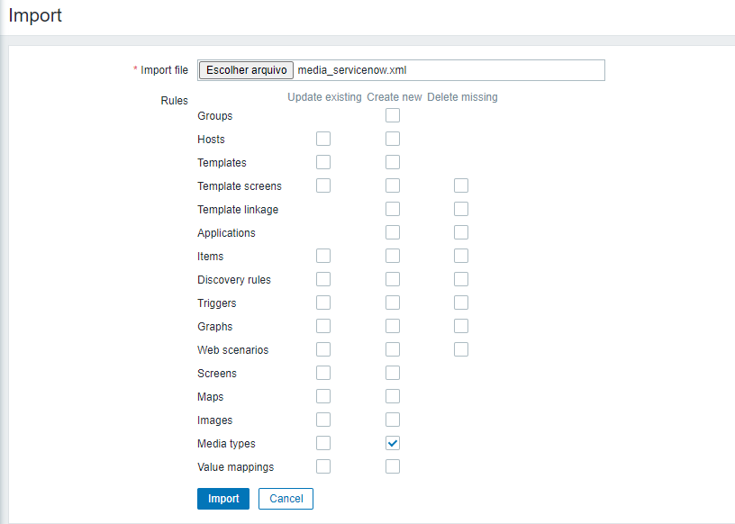
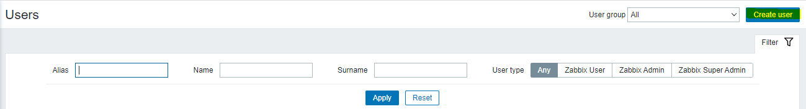
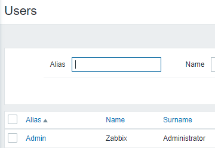
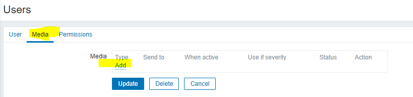
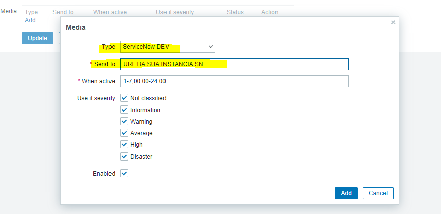
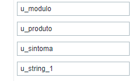
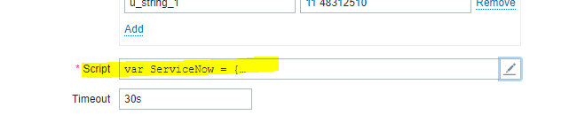
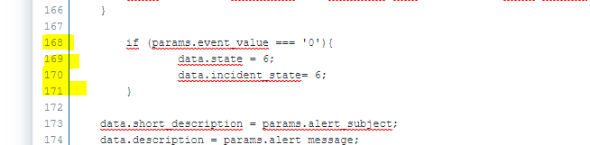
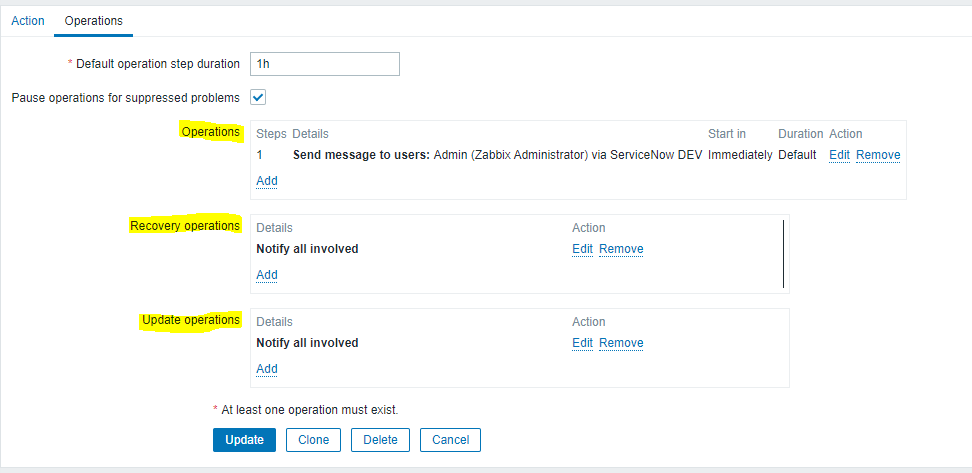

# Zabbix
A explicação abaixo demonstra como em MEU ambiente eu consegui integrar o Zabbix 5.0 com o ServiceNow fazendo com que a abertura, atualização e fechamento dos chamados abertos sejam feitos de forma automática. Pode ser que eu seu ambiente também necessite estes ajustes, por isso estarei demonstrando aqui.

O Media Type padrão apenas abre e atualiza o chamado, não fazendo o fechamento.

# Instalação

1 - Primeiramente exporte o media type padrão no Zabbix.

    (Adminstration -> Media Type -> Import)
    

	

    
    
2 - Crie ou use um usuário para que ele possa utilizar este media type.

    (Administration -> User -> Create User)
    

	

    (Administration -> User -> Select User)
    

	

    
3 - Com o usuário selecionado, na sessão Midia dele, cadastre o media type do ServiceNow.

    (Media -> Add -> Type: ServiceNow -> Send To: URL da sua instância Service Now)
    

	

	

    

# Configuração

Devemos agora customizar os campos a serem enviados para o ServiceNow

1 - Acesse seu media type ServiceNow

    (Adminstration -> Media Type -> ServiceNow)
    

	

    
2 - No meu caso eu adicionei os campos do ServiceNow: Tipo de Contato, Categoria, Local, Melhor horário para contato, Módulo, Produto, Sintoma e Telefone para contato.
Você deve ver no seu caso quais campos devem ser enviados pelo Zabbix ao ServiceNow e depois disso ver qual é o nome deles dentro da estrutura do ServiceNow.

	

3 - No media type desta documentação colocamos essa condição para quando o Zabbix enviar um alerta resolved ele jogue pra dentro da váriavel status o valor 6 (que para o nosso ambiente é o valor de Resolvido). Linhas 168 a 171 do campo Script no Media Type ServiceNow.

	if (params.event_value === '0'){
		data.state = 6;
		data.incident_state= 6;
	}
	

	

	

4 - Depois dessas configurações você pode seguir o caminho padrão de notificação via Action do Zabbix.

    (Configuration -> Action -> Create Action)
    
Deposi de configurar as triggers que serão disparadas com essa Action, no menu Operations você deve configurar as condições de disparo. Nesse caso o usuário Admin irá enviar uma mensagem via o Media Type ServiceNow DEV imediatamente e as opções de Recovery e Update serão Notify all involved.
    

	

